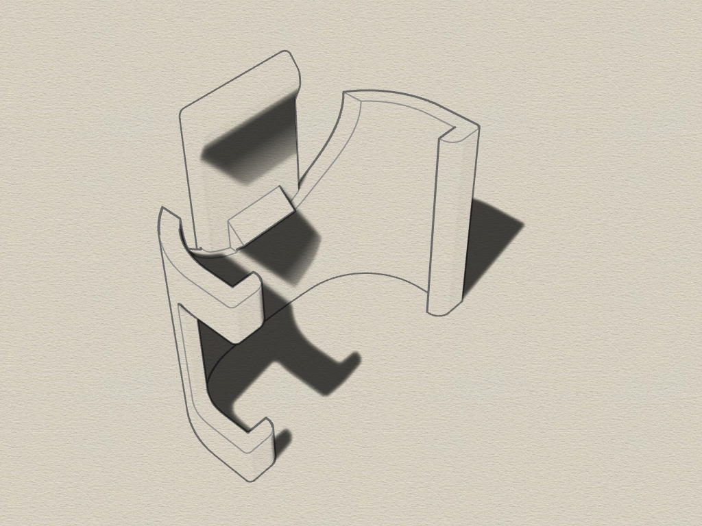

# AVM C6 phone clip
3D printable belt clip for AVM C6 phone, created with Rhino 6.

#### 3D clip
This phone clip can be used to mount an AVM C6 phone to your belt or whatever. 
Very usable if you use a headset and walk around while doing a phone call. 
I found a similar one. But the phone slipped throug and the Vol +/- Buttons did not match.
So i created this one which will snap the clip to the phone.

Requirements:
* 3D printer 
* Filament of your choice

#### View
 

